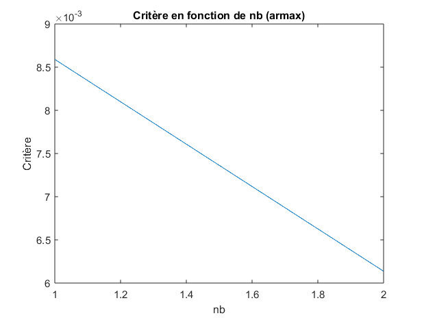
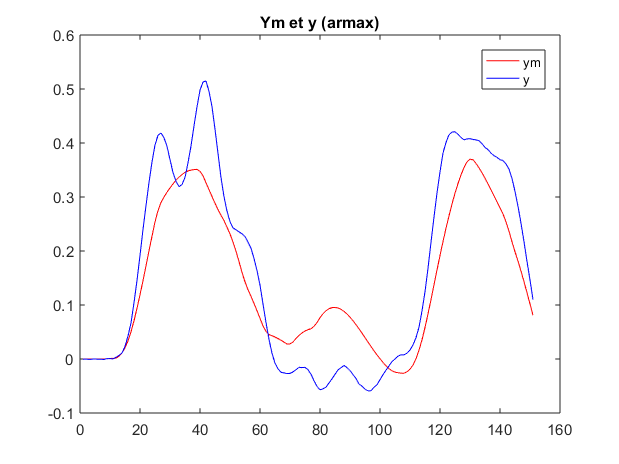

#Compte-rendu mini-projet SY15

##Introduction
Cette étude consiste à detérminer le modèle de d'identification le plus approprié aux valeurs d'entrée/sortie qui nous a été attribuées. 
Pour ceci nous allons tout d'abord étudier le système qui nous est présenté, puis choisir deux méthodes d'identification afin de construire des modèles et les comparer entre eux afin de déterminer lequel se rapproche le plus de la réalité. 

##Identification système

Tout d'abord nous avons commencé par identifier le retard. Pour cela, nous avons regardé l'entrée et la sortie. Le retard correspond au temps durant lequel nous avons une sortie nulle pour une entrée non nulle. 
Ici, la période de mesure est de 0.1 secondes, et pendant 12 mesures la sortie est nulle pour une entrée non nulle. 
Donc, le retard est de 1,2 secondes, qui sera arrondi à 1 seconde par la suite. 

##Choix de méthodes 

Nous avons choisi deux méthodes pour identifier le système : méthode des moindres carrés généralisée (ARMAX) et gradient (OE).

##Méthode ARMAX

Nous avons identifier les paramètres en essayant de minimiser le critère: 

* na : l'ordre du dénominateur
* nb : l'ordre du numérateur
* nc : l'ordre de la matrice C

En traçant le critère en fonction de na, puis,nb, puis nc, nous avons trouvé :

* na = 3

* nb = 2

* nc = 1

En comparant le modèle obtenu à la sortie réelle nous obtenons : 

##Méthode gradient 

De la même façon que pour la méthode des moindres carrés généralisés, nous identifions les paramètres nf et nb, en tentant de minimiser le critère, nous avons obtenu : 

* nf=2

* nb=2

En comparant le modèle obtenu à la sortie réelle nous obtenons : 

##Résultat comparaison 

Lorsque nous comparons les deux estimations à la sortie réelle, pour les paramètres identifiés ci-dessus, la méthode de gradient semble être plus proche de la réalité que la méthode ARMAX.

.png)

Pour la suite, nous retenons la méthode de **gradient**. 

##Fonction de transfert en échantilloné

$$
Hd(z) =  \frac{0.06639 z^{-1} - 0.05903 z^{-2}}{1 - 1.95 z^{-1} + 0.9568 z^{-2}}
$$

##Fonction de transfert en continu 

$$
H(s) = \frac{0.06415 s + 0.007525}{s^2 + 0.04414 s + 0.00727}
$$

##Réponse à un échelon et gain statique 

Le gain statique (s = 0) vaut : 

$$
\frac{0.007525}{ 0.00727}
= 1.035
$$

